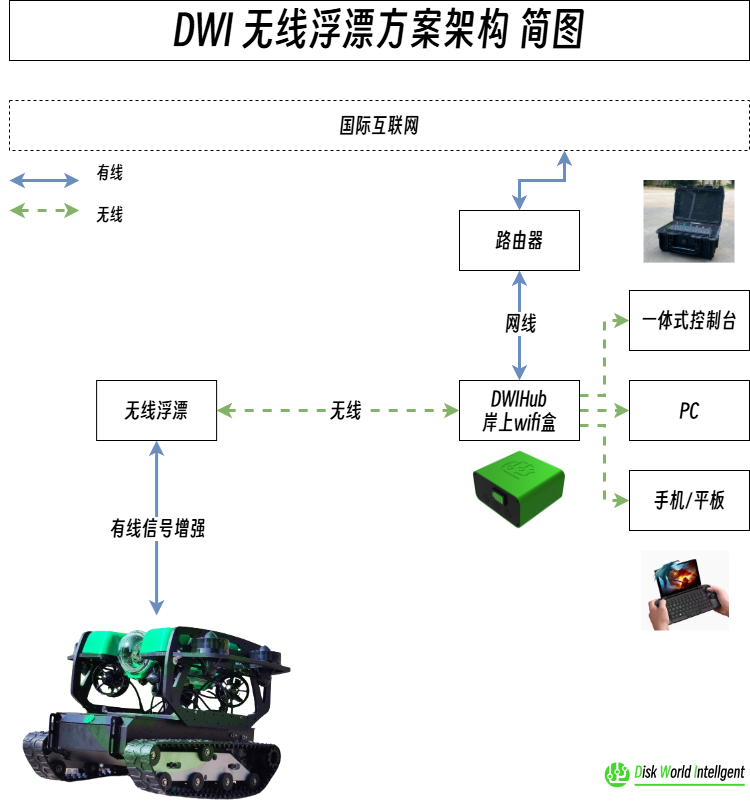
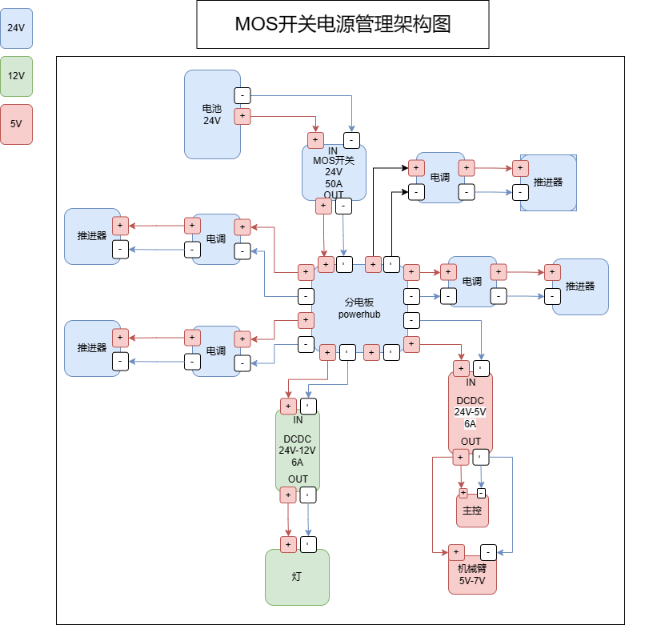
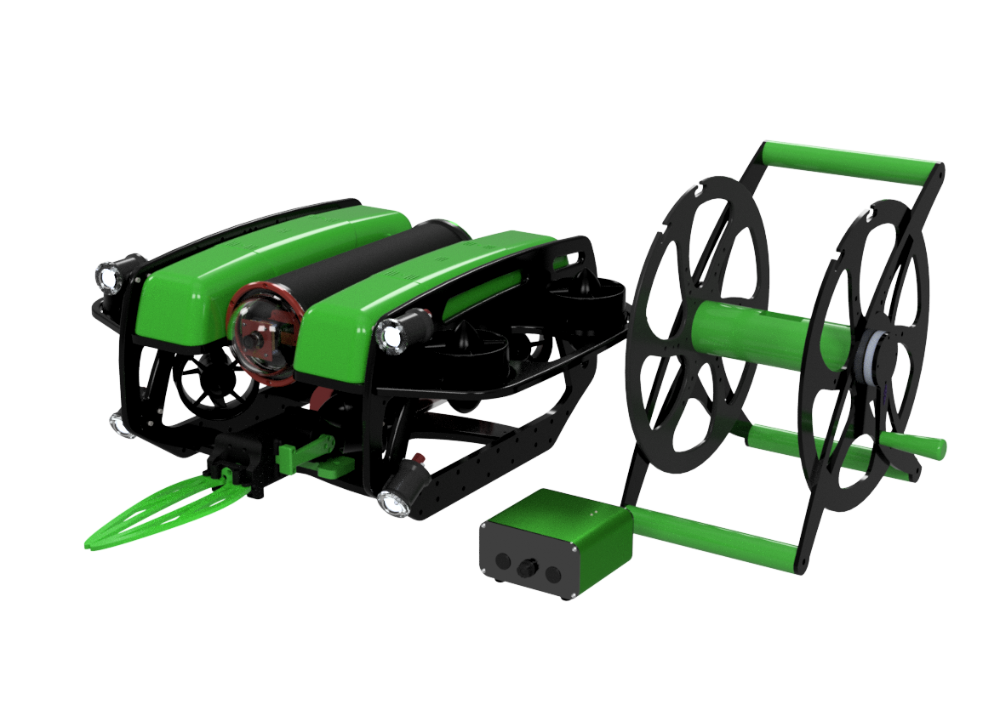

# ABROV参考文档

<!--  -->
https://www.douyin.com/user/self?modal_id=7340900808516504858

微信: 17863999712

*每台机器根据客户要求不一样, 请参考自己的设备包含的部分*

**文档内容仅供技术参考, 理论可完整实现;  非本公司实际使用技术. 不要根据这个参考改装机器

# !! [DWIHub版开机配置(适合有DWIHub的用户)](DWIHub版开机配置.md)
# !! [开机配置(适合无DWIHub的用户)](开机配置.md)

# [API&定制版说明](API&定制版说明.md)
# [API接口文档](ARS-API.md)

<!-- TOC -->

- [ABROV参考文档](#abrov%E5%8F%82%E8%80%83%E6%96%87%E6%A1%A3)
- [总体架构](#%E6%80%BB%E4%BD%93%E6%9E%B6%E6%9E%84)
    - [OTPS电源架构:](#otps%E7%94%B5%E6%BA%90%E6%9E%B6%E6%9E%84)
    - [DWI无线浮漂方案架构:](#dwi%E6%97%A0%E7%BA%BF%E6%B5%AE%E6%BC%82%E6%96%B9%E6%A1%88%E6%9E%B6%E6%9E%84)
    - [硬件架构接线图:](#%E7%A1%AC%E4%BB%B6%E6%9E%B6%E6%9E%84%E6%8E%A5%E7%BA%BF%E5%9B%BE)
    - [软件架构：](#%E8%BD%AF%E4%BB%B6%E6%9E%B6%E6%9E%84)
    - [硬件架构：](#%E7%A1%AC%E4%BB%B6%E6%9E%B6%E6%9E%84)
    - [网络结构:](#%E7%BD%91%E7%BB%9C%E7%BB%93%E6%9E%84)
    - [通信系统:](#%E9%80%9A%E4%BF%A1%E7%B3%BB%E7%BB%9F)
    - [AI目标检测系统示意图](#ai%E7%9B%AE%E6%A0%87%E6%A3%80%E6%B5%8B%E7%B3%BB%E7%BB%9F%E7%A4%BA%E6%84%8F%E5%9B%BE)
    - [BCM2837主控原理图:](#bcm2837%E4%B8%BB%E6%8E%A7%E5%8E%9F%E7%90%86%E5%9B%BE)
- [硬件](#%E7%A1%AC%E4%BB%B6)
    - [Pixhawk 2.4.8 飞控](#pixhawk-248-%E9%A3%9E%E6%8E%A7)
    - [树莓派](#%E6%A0%91%E8%8E%93%E6%B4%BE)
    - [MCU](#mcu)
    - [G模块](#g%E6%A8%A1%E5%9D%97)
    - [传感器单元](#%E4%BC%A0%E6%84%9F%E5%99%A8%E5%8D%95%E5%85%83)
        - [深度传感器MS5837](#%E6%B7%B1%E5%BA%A6%E4%BC%A0%E6%84%9F%E5%99%A8ms5837)
    - [运动控制单元](#%E8%BF%90%E5%8A%A8%E6%8E%A7%E5%88%B6%E5%8D%95%E5%85%83)
- [通信系统](#%E9%80%9A%E4%BF%A1%E7%B3%BB%E7%BB%9F)
- [算法](#%E7%AE%97%E6%B3%95)
    - [AI目标识别](#ai%E7%9B%AE%E6%A0%87%E8%AF%86%E5%88%AB)
        - [海洋垃圾监测](#%E6%B5%B7%E6%B4%8B%E5%9E%83%E5%9C%BE%E7%9B%91%E6%B5%8B)
        - [机械臂移动与抓取](#%E6%9C%BA%E6%A2%B0%E8%87%82%E7%A7%BB%E5%8A%A8%E4%B8%8E%E6%8A%93%E5%8F%96)
        - [完整项目](#%E5%AE%8C%E6%95%B4%E9%A1%B9%E7%9B%AE)
- [理论支持](#%E7%90%86%E8%AE%BA%E6%94%AF%E6%8C%81)
    - [Yolov5网络结构图](#yolov5%E7%BD%91%E7%BB%9C%E7%BB%93%E6%9E%84%E5%9B%BE)
- [参数](#%E5%8F%82%E6%95%B0)
    - [参数-ROV-框架式](#%E5%8F%82%E6%95%B0-rov-%E6%A1%86%E6%9E%B6%E5%BC%8F)
    - [规格](#%E8%A7%84%E6%A0%BC)
    - [系统要求](#%E7%B3%BB%E7%BB%9F%E8%A6%81%E6%B1%82)
    - [D 图纸](#d-%E5%9B%BE%E7%BA%B8)

<!-- /TOC -->

# 总体架构
## OTPS电源架构:

## DWI无线浮漂方案架构:

## 硬件架构(接线图):

## 软件架构：

## 硬件架构：

## 网络结构:

## 通信系统:

## AI目标检测系统示意图

## BCM2837主控原理图:

# 硬件
## Pixhawk 2.4.8 飞控

优势: 自带稳定算法, 提供官方上位机软件可以直接使用QGC软件控制, 可以自定义引脚的输出, 实时做出改变, 可以外接传感器 灯光 机械臂等外围硬件

## 树莓派

+ 上位机采用BCM2837, 用来作为STM32的信号中继和摄像头图像的推流
优势: 有板载网口方便作为信号的中继, 有板载GPIO方便开发连接下位机, 板载USB口可以直接安装摄像头, 读取摄像头数据
## MCU

+ 控制系统基于STM32F427单片机, 可以输出8个PWM信号, 控制整个机器人的6台推进器, 保证机器人的运动。协处理器使用STM32F100, 可以输出6个PWM信号, 控制ROV的灯光和机械臂的俯仰运动和抓取。

## 5G模块

优势: 自带天线和USB口, 可以直接插到树莓派上面进行使用, 提供LINUX驱动, 组网快捷方便, 插入5G卡使用
## 传感器单元
###  深度传感器MS5837

ELEC-DSI．3050内部传感器型号：TEMs5837·30BA50女兼容Ardusub.ELEC-DSI·3026内部传感器型号：TEMs5837·30BA26elec-dsl·3026的优点和区别：高化学耐久性和金属屏蔽，增强的结构和设计，材料允许在苛刻的液体介质环境中暴露，增强的化学耐久性。

## 运动控制单元

STM32F407使用PWM信号连接水下推进器的无刷电子调速器, 通过调整占空比, 控制推进器的转速, 从而使得ROV做出相应的运动姿态。水下推进器所使用无刷电子调速器为20A, PWM信号频率最高支持500HZ。下图为无刷电子调速器。

# 通信系统
1、通信方式

本系统中STM32F407和传感器单元采用IIC总线通信。

2、IIC协议

IIC通信过程由开始、结束、发送、响应、接收五个部分构成。

1) 开始信号和结束信号
    
    开始信号：当SCL为高期间，SDA由高到低的跳变；
    
    停止信号：当SCL为高期间，SDA由低到高的跳变；

2) 数据传输

    SDA的数据在SCL高电平期间被写入从机。所以SDA的数据变化要发生在SCL低电平期间。

3) 应答信号

    一个字节按数据位从高位到低位的顺序传输完后，紧接着从设备将拉低SDA线，回传给主设备一个应答位(ACK)， 此时才认为一个字节真正的被传输完成。并不是所有的字节传输都必须有一个应答位，比如：当从设备不能再接收主设备发送的数据时，从设备将回传一个否定应答位(UACK)。

4) 设备地址选取
I2C总线上的每一个设备都对应一个唯一的地址,主设备在传输有效数据之前要先指定从设备的地址，地址指定的过程和上面数据传输的过程一样，只不过大多数从设备的地址是7位的，然后协议规定再给地址添加一个最低位用来表示接下来数据传输的方向，0表示主设备向从设备写数据，1表示主设备向从设备读数据,每一小包数据由9位bit组成。

# 算法
## AI目标识别

### 海洋垃圾监测

​	使用YOLOV5自主训练海洋垃圾数据集, 使用3080显卡,共训练上千epochs, 使用基础权重为yolov5l.pt, 如下为训练过程:

Tensor board训练过程如下, 随着epochs的增加, AI的mAP_0.5也在持续上升, 但是当epochs的数量超过400时, 整个AI的mAP_0.5反倒开始下降, 此时说明整个模型weights处于过拟合的状态, 需要增加更多数据集。如下图6所示:

图6 Tensor board训练过程

图7是所有epochs训练完成之后, 使用视频对训练效果进行验证, 所使用的conf 0.7, 从视频中明显看出, 由于海洋垃圾的数据量多, 所以对于海洋垃圾的检测十分准确且一直没有丢失, 反倒对于生物和ROV的检测由于数据量少, 检测容易出错和丢失。如下图7, 海洋垃圾检测效果十分出色

图7海洋垃圾检测效果十分出色

摄像头通过BCM2837推流图像信息到控制端, 控制端pytorch服务会拉取视频流并进行处理, 将处理后的结果输出显示到监视器。Pytorch运行的yolov5服务会对图像中的海洋垃圾、生物、ROV进行分类识别。协助完成海洋垃圾的分拣工作, 还给海洋干净。

### 机械臂移动与抓取

通过遥控器控制机械臂的俯仰角度和机械臂的抓取, 机械臂的俯仰角度在500-2200之间。机械臂的抓取也在500-2200之间。在完成AI目标检测之后, 控制机器人靠近, 然后调整机械臂的俯仰角度进行抓取, 抓取后可以放下机械臂, 避免遮挡ROV的水下视线。

图17 AI目标检测机械臂抓取效果图

### 完整项目
+ 询问客服

# 理论支持

## Yolov5网络结构图

YOLOv5是一种单阶段目标检测算法，该算法在YOLOv4的基础上添加了一些新的改进思路，使其速度与精度都得到了极大的性能提升。主要的改进思路如下所示：

 

输入端：在模型训练阶段，提出了一些改进思路，主要包括Mosaic数据增强、自适应锚框计算、自适应图片缩放；

基准网络：融合其它检测算法中的一些新思路，主要包括：Focus结构与CSP结构；

Neck网络：目标检测网络在BackBone与最后的Head输出层之间往往会插入一些层，Yolov5中添加了FPN+PAN结构；

Head输出层：输出层的锚框机制与YOLOv4相同，主要改进的是训练时的损失函数GIOU_Loss，以及预测框筛选的DIOU_nms。

上图展示了YOLOv5目标检测算法的整体框图。对于一个目标检测算法而言，我们通常可以将其划分为4个通用的模块，具体包括：输入端、基准网络、Neck网络与Head输出端，对应于上图中的4个红色模块。YOLOv5算法具有4个版本，具体包括：YOLOv5s、YOLOv5m、YOLOv5l、YOLOv5x四种，本文重点讲解YOLOv5s，其它的版本都在该版本的基础上对网络进行加深与加宽。

输入端-输入端表示输入的图片。该网络的输入图像大小为608*608，该阶段通常包含一个图像预处理阶段，即将输入图像缩放到网络的输入大小，并进行归一化等操作。在网络训练阶段，YOLOv5使用Mosaic数据增强操作提升模型的训练速度和网络的精度；并提出了一种自适应锚框计算与自适应图片缩放方法。

基准网络-基准网络通常是一些性能优异的分类器种的网络，该模块用来提取一些通用的特征表示。YOLOv5中不仅使用了CSPDarknet53结构，而且使用了Focus结构作为基准网络。

Neck网络-Neck网络通常位于基准网络和头网络的中间位置，利用它可以进一步提升特征的多样性及鲁棒性。虽然YOLOv5同样用到了SPP模块、FPN+PAN模块，但是实现的细节有些不同。

Head输出端-Head用来完成目标检测结果的输出。针对不同的检测算法，输出端的分支个数不尽相同，通常包含一个分类分支和一个回归分支。YOLOv4利用GIOU_Loss来代替Smooth L1 Loss函数，从而进一步提升算法的检测精度

# 参数
## 参数-ROV-框架式
## 规格

| **参数**                          |                                                               国际                                                               |         英规         |
| ------------------------------- | :----------------------------------------------------------------------------------------------------------------------------: | :----------------: |
| **物理的**                         |                                                                                                                                |                    |
| 长度                              |                                                             457 mm                                                             |       18 in        |
| 宽度                              |                                                             338 mm                                                             |      13.3 in       |
| 高度                              |                                                             254 mm                                                             |       10 in        |
| 空气重量（使用电池）                      |                                                            11-12 kg                                                            |      24-27 lb      |
| 空气重量（不含电池）                      |                                                            9-10 kg                                                             |      20-22 lb      |
| 电缆穿透器孔                          |                                                       共 18 个，其中 6 个可用于扩展                                                       |                    |
| 接液材料                            |                           6061-T6， 7075-T6 阳极氧化铝 316， 18-8 不锈钢   高分子聚合物塑料   尼龙 树脂 化合物                           |                    |
| 电子外壳                            |                                                             110外壳                                                              |                    |
| 电池外壳                            |                                                              80外壳                                                              |                    |
| 浮力泡沫                            |                                                           高强度深海浮力泡沫                                                            |                    |
| 配重重量                            |                                                        18 x 100 克不锈钢砝码                                                         |                    |
| **性能**                          |                                                                                                                                |                    |
| 最大额定深度                          |                                                        100 米   300 米                                                        | 330 英尺   985 英尺 |
| 温度范围                            |                                                            0-30°摄氏度                                                            |     32-86°华氏度      |
| 有效载荷容量（取决于配置）                   |                                                             3-40kg                                                             |                    |
| 最大前进速度                          |                                                            1.5 米/秒                                                             |         3节         |
| 前系柱推力 （45°）                     |                                                             6-40kg                                                             |                    |
| 垂直系柱推力                          |                                                             6-40kg                                                             |                    |
| 侧向系柱推力 （45°）                    |                                                             6-40kg                                                             |                    |
| 推进器配置                           |                                                6 个推进器（4 个水平推进器，2 个垂直推进器   ）                                                 |                    |
| **电池**                          |                                                                                                                                |                    |
| 电池寿命（16Ah 电池） |                                        ~2 小时（正常使用）   ~4 小时（轻度使用）   电池可在大约 30 秒内更换                                        |                    |
| 电池连接器                           |                                                              水下插头                                                              |                    |
| **灯**                           |                                                                                                                                |                    |
| 亮度                              |                                                        每个 2200 流明，带调光控制                                                        |                    |
| 光束角                             |                                                           135度，倾斜度可调                                                           |                    |
| **系链**                          |                                                                                                                                |                    |
| 直径                              |                                                             7.6 毫米                                                             |      0.30 英寸       |
| 长度                              |                                                            25-300米                                                             |     80-980 英尺      |
| 工作强度                            |                                                             45公斤力                                                              |       100磅力        |
| 断裂强度                            |                                                             160公斤力                                                             |       350磅力        |
| 实力会员                            |                                                           带水冷头的凯夫拉尔                                                            |                    |
| 淡水中的浮力                          |                                                               中性                                                               |                    |
| 盐水中的浮力                          |                                                              略微阳性                                                              |                    |
| 导体                              |                                                        4 或 1 双绞线，26 AWG                                                        |                    |
| **传感器**                         |                                                                                                                                |                    |
| IMU                             |                                                        6-自由度 IMU（在导航器上）                                                        |                    |
| 指南针                             |                                                   双 3 自由度磁力计（在 Navigator 上）                                                    |                    |
| 内压                              |                                                          内部气压计（在导航器上）                                                          |                    |
| 压力/深度和温度传感器（外部）                 |                                                            水下深度传感器                                                             |                    |
| 电流和电压检测                         |                                                             电压检测板                                                              |                    |
| 泄漏传感器                           |                                                     集成泄漏传感器（在 Navigator 上）                                                     |                    |
| **相机倾斜**                        |                                                                                                                                |                    |
| 倾斜范围                            |                                                     +/- 90 度相机倾斜度（总范围 180）                                                     |                    |
| 倾斜舵机                            |                                                        PWM 1500中值 云台有自稳                                                        |                    |
| **照相机**                         |                                                                                                                                |                    |
| 相机型号                            |                                                            低光高清摄像头                                                             |                    |
| 分辨率                             |                                                        1080p / 2k / 4k                                                         |                    |
| 视野（水下）                          |                                                            110度（水平）                                                            |                    |
| 感光度                             |                                                           低光照0.01lux                                                           |                    |
| **控制系统**                        |                                                                                                                                |                    |
| 板载计算机                           |                                                        参考配置 LinuxARM主控                                                         |                    |
| 软件                              |                                                         ARG / QGround                                                          |                    |
| ¹ 某些有效载荷配置将需要额外的浮力。             |                                                                                                                                |                    |

## 系统要求

| **参数**                                                                                        | **价值**                       |
| --------------------------------------------------------------------------------------------- | ---------------------------- |
| **操作系统**                                                                                      |                              |
| 窗户                                                                                            | Windows 10 64 位或更高版本 Android |
| MacOS操作系统                                                                                     | 10.20 或更高版本                  |
| Ubuntu的                                                                                       | 最新的 LTS （20.04） 或更高版本        |
| **推荐硬件¹**                                                                                     |                              |
| 处理器                                                                                           | i5 处理器同等或更高                  |
| 独立 Nvidia 或 AMD 显卡²                                                                           | AI需要                         |
| 公羊                                                                                            | 8千兆字节                        |
| 存储                                                                                            | 固态硬盘 （SSD）                   |
| ¹ 地面控制站软件性能取决于系统环境、第三方应用程序和可用的系统资源。功能更强大的硬件将提供更好的体验。   ² 在大多数情况下，集成显卡是合适的，建议使用独立显卡以获得最佳体验。 |                              |

## 2D 图纸

