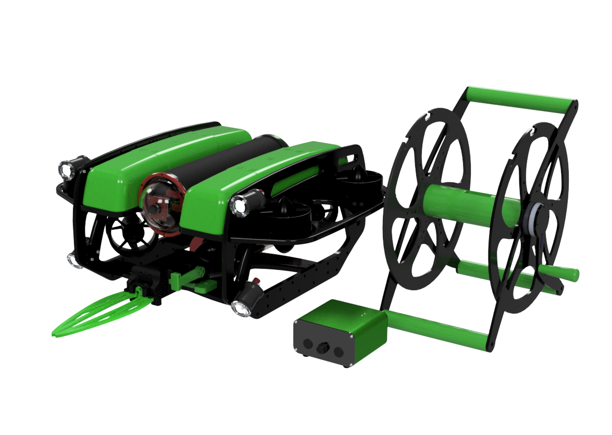

## 规格

| **参数**                          |                                                               国际                                                               |         英规         |
| ------------------------------- | :----------------------------------------------------------------------------------------------------------------------------: | :----------------: |
| **物理的**                         |                                                                                                                                |                    |
| 长度                              |                                                             457 mm                                                             |       18 in        |
| 宽度                              |                                                             338 mm                                                             |      13.3 in       |
| 高度                              |                                                             254 mm                                                             |       10 in        |
| 空气重量（使用电池）                      |                                                            11-12 kg                                                            |      24-27 lb      |
| 空气重量（不含电池）                      |                                                            9-10 kg                                                             |      20-22 lb      |
| 电缆穿透器孔                          |                                                       共 18 个，其中 6 个可用于扩展                                                       |                    |
| 接液材料                            |                           6061-T6， 7075-T6 阳极氧化铝 316， 18-8 不锈钢   高分子聚合物塑料   尼龙 树脂 化合物                           |                    |
| 电子外壳                            |                                                             110外壳                                                              |                    |
| 电池外壳                            |                                                              80外壳                                                              |                    |
| 浮力泡沫                            |                                                           高强度深海浮力泡沫                                                            |                    |
| 配重重量                            |                                                        18 x 100 克不锈钢砝码                                                         |                    |
| **性能**                          |                                                                                                                                |                    |
| 最大额定深度                          |                                                        100 米   300 米                                                        | 330 英尺   985 英尺 |
| 温度范围                            |                                                            0-30°摄氏度                                                            |     32-86°华氏度      |
| 有效载荷容量（取决于配置）                   |                                                             3-40kg                                                             |                    |
| 最大前进速度                          |                                                            1.5 米/秒                                                             |         3节         |
| 前系柱推力 （45°）                     |                                                             6-40kg                                                             |                    |
| 垂直系柱推力                          |                                                             6-40kg                                                             |                    |
| 侧向系柱推力 （45°）                    |                                                             6-40kg                                                             |                    |
| 推进器配置                           |                                                6 个推进器（4 个水平推进器，2 个垂直推进器   ）                                                 |                    |
| **电池**                          |                                                                                                                                |                    |
| 电池寿命（带 Blue Robotics 15.6Ah 电池） |                                        ~2 小时（正常使用）   ~4 小时（轻度使用）   电池可在大约 30 秒内更换                                        |                    |
| 电池连接器                           |                                                              水下插头                                                              |                    |
| **灯**                           |                                                                                                                                |                    |
| 亮度                              |                                                        每个 2200 流明，带调光控制                                                        |                    |
| 光束角                             |                                                           135度，倾斜度可调                                                           |                    |
| **系链**                          |                                                                                                                                |                    |
| 直径                              |                                                             7.6 毫米                                                             |      0.30 英寸       |
| 长度                              |                                                            25-300米                                                             |     80-980 英尺      |
| 工作强度                            |                                                             45公斤力                                                              |       100磅力        |
| 断裂强度                            |                                                             160公斤力                                                             |       350磅力        |
| 实力会员                            |                                                           带水冷头的凯夫拉尔                                                            |                    |
| 淡水中的浮力                          |                                                               中性                                                               |                    |
| 盐水中的浮力                          |                                                              略微阳性                                                              |                    |
| 导体                              |                                                        4 或 1 双绞线，26 AWG                                                        |                    |
| **传感器**                         |                                                                                                                                |                    |
| IMU                             |                                                        6-自由度 IMU（在导航器上）                                                        |                    |
| 指南针                             |                                                   双 3 自由度磁力计（在 Navigator 上）                                                    |                    |
| 内压                              |                                                          内部气压计（在导航器上）                                                          |                    |
| 压力/深度和温度传感器（外部）                 |                                                            水下深度传感器                                                             |                    |
| 电流和电压检测                         |                                                             电压检测板                                                              |                    |
| 泄漏传感器                           |                                                     集成泄漏传感器（在 Navigator 上）                                                     |                    |
| **相机倾斜**                        |                                                                                                                                |                    |
| 倾斜范围                            |                                                     +/- 90 度相机倾斜度（总范围 180）                                                     |                    |
| 倾斜舵机                            |                                                        PWM 1500中值 云台有自稳                                                        |                    |
| **照相机**                         |                                                                                                                                |                    |
| 相机型号                            |                                                            低光高清摄像头                                                             |                    |
| 分辨率                             |                                                        1080p / 2k / 4k                                                         |                    |
| 视野（水下）                          |                                                            110度（水平）                                                            |                    |
| 感光度                             |                                                           低光照0.01lux                                                           |                    |
| **控制系统**                        |                                                                                                                                |                    |
| 板载计算机                           |                                                        参考配置 LinuxARM主控                                                         |                    |
| 软件                              |                                                         ARG / QGround                                                          |                    |
| ¹ 某些有效载荷配置将需要额外的浮力。             |                                                                                                                                |                    |

## 系统要求

| **参数**                                                                                        | **价值**                       |
| --------------------------------------------------------------------------------------------- | ---------------------------- |
| **操作系统**                                                                                      |                              |
| 窗户                                                                                            | Windows 10 64 位或更高版本 Android |
| MacOS操作系统                                                                                     | 10.20 或更高版本                  |
| Ubuntu的                                                                                       | 最新的 LTS （20.04） 或更高版本        |
| **推荐硬件¹**                                                                                     |                              |
| 处理器                                                                                           | i5 处理器同等或更高                  |
| 独立 Nvidia 或 AMD 显卡²                                                                           | AI需要                         |
| 公羊                                                                                            | 8千兆字节                        |
| 存储                                                                                            | 固态硬盘 （SSD）                   |
| ¹ 地面控制站软件性能取决于系统环境、第三方应用程序和可用的系统资源。功能更强大的硬件将提供更好的体验。   ² 在大多数情况下，集成显卡是合适的，建议使用独立显卡以获得最佳体验。 |                              |

## 2D 图纸

