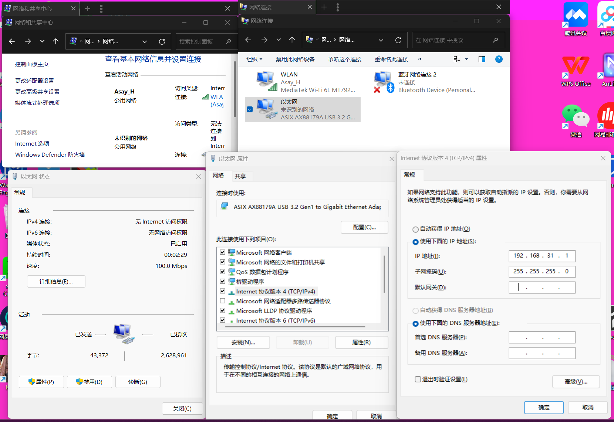
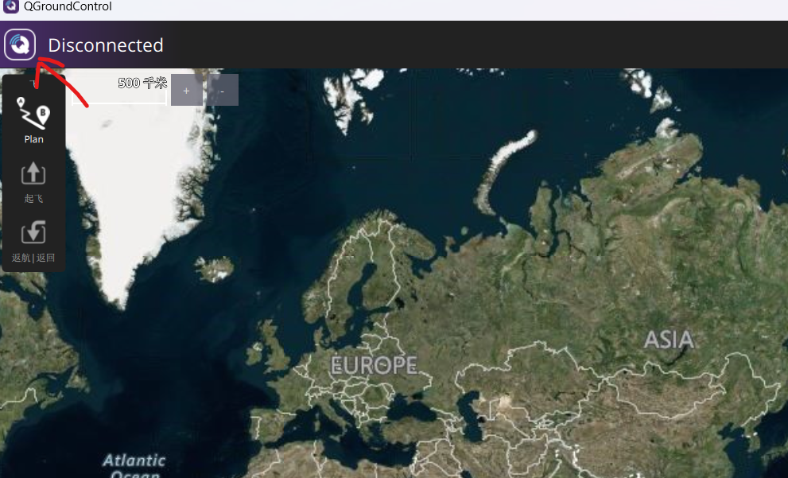
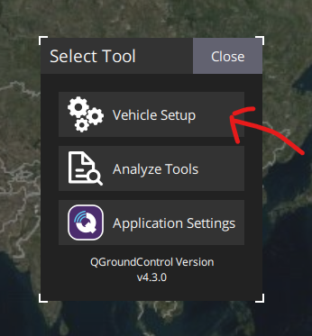
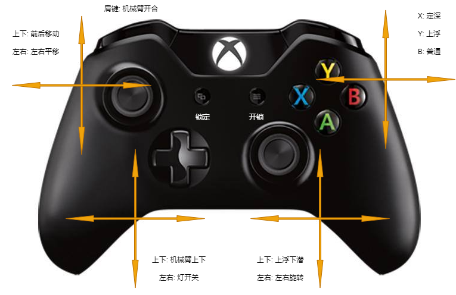
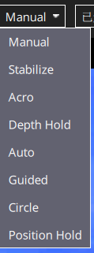

# 开机配置

## 找到机器的IP
```
设备默认: 192.168.31.233
默认网关: 192.168.31.1
```
1. 插路由器后台查看
2. 下载ip扫描器扫描: https://www.advanced-ip-scanner.com/cn/

## 下载软件

+ API版-QGC: http://qgroundcontrol.com/
+ 定制版: 询问客服定制软件界面

## 网络设置

1. 窗口**控制面板**选择**网络与共享中心**. 如果您没有看到“网络和共享中心”，请将“**查看由**选项到大或小的图标。


2. 在“网络和共享中心”窗口中，选择**更改适配器设置**.


3. 以太网适配器，右键单击此以太网适配器，然后选择**属性**.


4. 在属性对话框中，点击**互联网协议版本4（TCP/IPv4）**来突出显示它，然后点击**属性**.


5. 选择使用以下IP地址**192.168.31.1**为IP地址和**255.255.255.0**子网掩码。选择OK，然后您可以关闭其余的窗口。



## 防火墙

1. **控制面板**然后选择**Windows Defender防火墙**. 如果您没有看到Windows Defender防火墙，请更改**查看由**选项到大或小的图标。


2. 选择“允许应用程序或功能通过Windows Defender防火墙”.


2. 选择**更改设置**，在应用列表中找到“QGroundControl开发团队提供的开源地面控制应用程序”或“QGroundControl”。旁边的框中选中后点OK.


# 手柄遥控

+ 开启手柄





1. 手柄选项, 开启手柄打钩

2. 手柄说明, 操作需要先解锁电机



# QGC说明


+ Manual - 手动模式允许操作员直接控制航行器的推进器，没有任何自动稳定或自动控制干预。

+ Stabilize - 稳定模式会自动保持航行器的水平姿态。在这个模式下，如果操作员释放控制杆，航行器会自动恢复水平位置。

+ Acro - 特技模式，提供了高级的机动性能和控制灵敏度，适用于经验丰富的操作员。在这个模式下，航行器的响应更加敏感和迅速。

+ Depth Hold - 深度保持模式允许航行器在水平方向上自由移动，同时自动保持当前水深，不上浮也不下沉。

+ Auto - 自动模式根据预设的任务或路径进行自动航行。操作员设定好路线后，航行器会自动执行。

+ Guided - 导引模式允许操作员通过指定具体的目标点或路径来远程控制航行器，通常用于复杂或精确的操作。

+ Circle - 圆周模式使航行器围绕一个指定的GPS坐标或目标物自动旋转。

+ Position Hold - 位置保持模式使航行器保持在一个固定的位置和姿态，即使在水流或其它外力的影响下也能保持不动。

每种模式都有其特定的用途和优点，适用于不同的操作需求和环境条件。选择合适的模式可以提高操作效率和安全性。